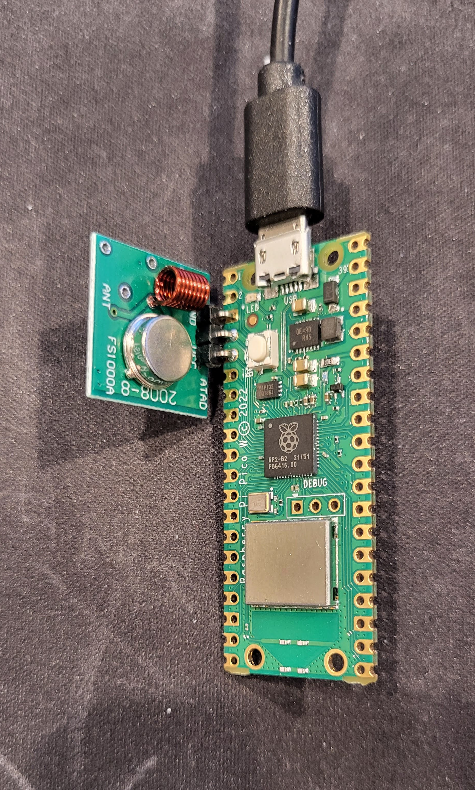

# rfsend
This script will use an RF transmitter to send files that have been captured with a [Flipper Zero](https://flipperzero.one/).  The intent is that it can be used with home automation so it listens for commands via [MQTT](https://mqtt.org/).

At the moment it only supports .sub files captured using Read RAW with AM modulation (aka OOK/ASK).

## Setup for Raspberry Pi Pico W
- [Install Micropython ](https://www.raspberrypi.com/documentation/microcontrollers/micropython.html)
- Edit `rfsend.py`:
  - Set your WiFi SSID and password
  - Set your MQTT broker's IP
  - Set the topic to which it will listen
  - Rename it to code.py so it will run when at power on
- Upload this code with a tool like [Thonny](https://thonny.org/)
- Upload some .sub files captured with the Flipper Zero into a directory named "buttons"
- Attach an RF transmitter like this [FS1000A](https://amazon.com/dp/B00LNADJS6) (the receiver isn't used)

## Usage
- To replay one of the .sub files, send an MQTT message with a JSON payload that has a single key `button` whose value is the name of the file (without the `.sub` extension)

### Example:
The default MQTT topic in this file is `rfsend`.  That will tell it to subscribe to `cmd/rfsend/req`. To send the sample file `buttons/zshine/1_up.sub`, publish an MQTT message with contents:

    {"button": "zshine/1_up"}

It will confirm by publishing the same message back to the response topic: `cmd/rfsend/resp`
